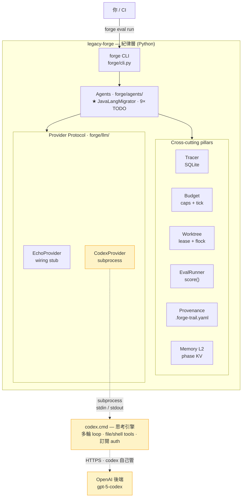
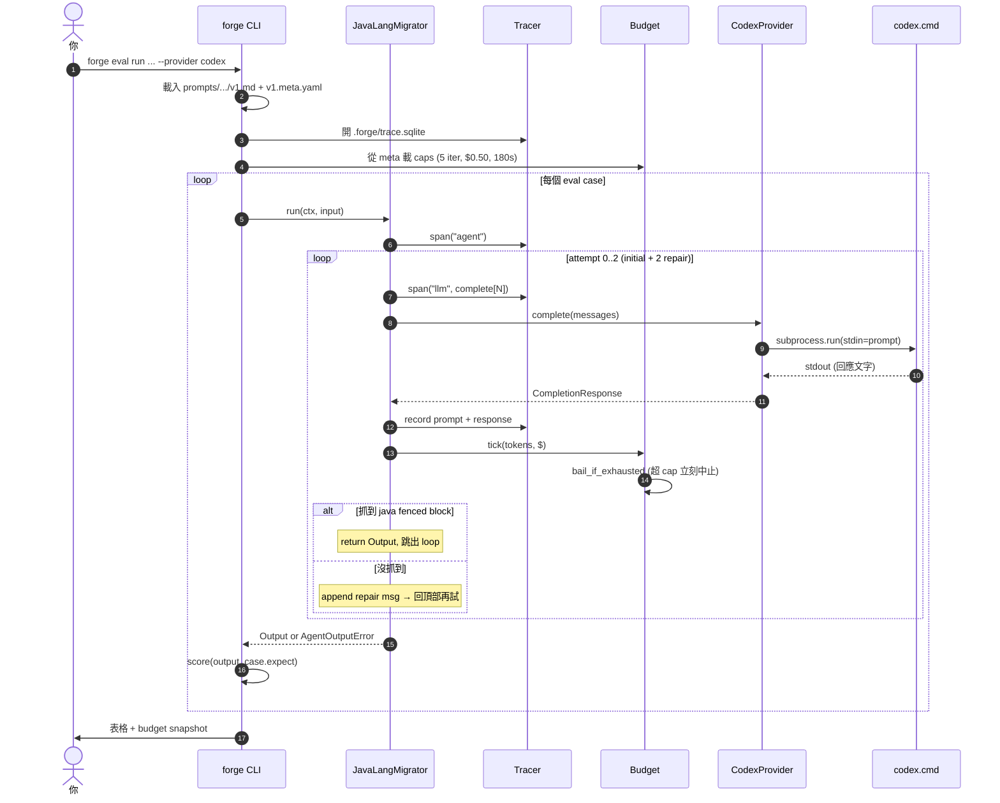
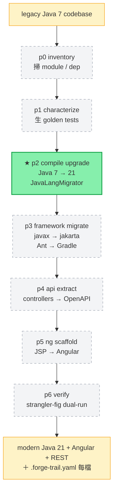

# Architecture

三張圖，由外往內看。Mermaid 寫的，GitHub 上自動 render。

---

## 1. 全景 — 誰在哪一層



**讀法**：
- **forge** = 紀律層。它不會自己「想」，但負責**測 / 記 / 限 / 稽核**。
- **codex CLI** = 思考引擎。它不會自己**記**（不知道你昨天跑過什麼、預算剩多少、要不要寫 trail）。
- **Provider Protocol** 是兩者之間的薄玻璃。換 codex 換 Anthropic SDK 換本地模型，只動 `forge/llm/<新>.py`，agent 跟 pillars 不知道。

---

## 2. 跑起來 — 時間線

`forge eval run java-lang-migrator --provider codex` 從按下到完成的呼叫序列：



關鍵：
- **每個 LLM call 一個 span**：trace 可以 replay、可以 diff prompt 版本。
- **每個 call 都 tick budget**：超就 raise，不會「再試一次就好」。
- **repair loop 內建在 agent**：模型回錯格式不會 silently fallback 到原 source，2 次 retry 後 `AgentOutputError`。

---

## 3. 7-phase pipeline — 終局

`default_pipeline()` 的 DAG。今天只有 p2 是 wired，其他是 phase placeholder（`forge phases` 顯示 `wired=no`）。



每個 phase 都是一個 human-approval gate：agent 在 phase 內 fan out，phase 邊界要過人眼。

每個 phase box 內，forge 都會包這些東西：

| Pillar | 該 phase 拿到什麼 |
|---|---|
| Tracer | 該 phase 跑了幾次 LLM、燒了多少 token / $ |
| Budget | 超就停（每 phase 自己的 cap） |
| Worktree | 在自己 git worktree 動，搞砸不污染 main |
| Memory L2 | 讀上游 phase 留的 artifact（例：p0 算的 module 清單） |
| Provenance | 給每個生成檔寫 `.forge-trail.yaml` |
| EvalRunner | 該 phase 自己的 golden cases，pass rate 守底線 |

---

## TL;DR

```
codex = 「想」
forge = 「記得想過什麼 + 限制怎麼想 + 證明想對了」
```

兩者 orthogonal。換掉 codex 不會動 forge，換掉 forge 不會動 codex。Windows + 訂閱 codex CLI 的情境，只是把 forge 的 Provider Protocol 透過 subprocess 接到 `codex.cmd` —— 見 [README 的「接 codex CLI」一節](../README.md)。

---

## Decisions worth recording

幾個寫死在這個專案 DNA 裡的設計選擇，後來想改之前先看這裡：

- **Python harness，即使 codex CLI 是 JS。** Harness 透過 subprocess 呼叫 codex（或任何 LLM CLI）。Python 在 SQLite、subprocess、SDK ergonomics 上贏面比較大。
- **每個專案一份 SQLite trace DB，不是每 run 一份。** Cross-run 分析（哪次 prompt 改動讓 cost 上升？）需要全部在同一個地方。
- **Provenance 用 sidecar YAML，不寫在檔案裡。** 註解會 rot；sidecar 可以在 PR hook 強制檢查。
- **Worktree per task，不是 per agent。** Agent 是 stateless，worktree 才是隔離單位。
- **Provider Protocol 用 `list[Message]` 不是單字串。** 多輪 tool-using agent 來的那天，這層不用再破協議。
- **Agent 失敗就 raise，不 silent fallback。** 之前的 `extract_java_block(text) or inp.source_code` bug 教訓 —— silent fallback 讓 eval falsely PASS，比沒有 eval 還糟。

更深的設計理由見 [seven-pillars.md](seven-pillars.md)；日常操作見 [runbook.md](runbook.md)。
